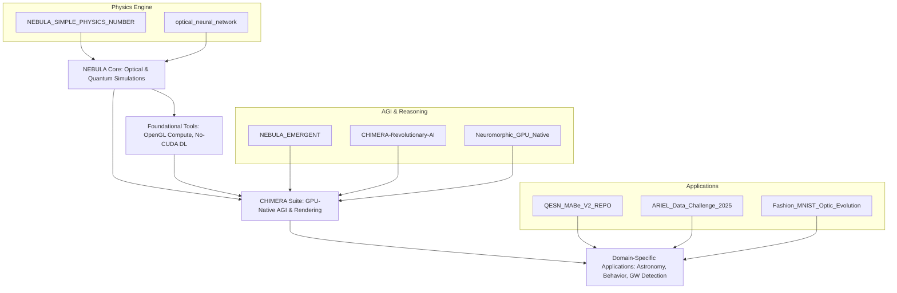
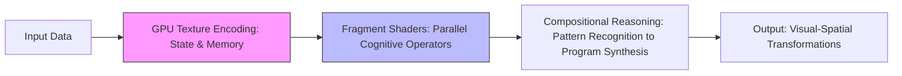

# NEBULA & CHIMERA: Pioneering Neuromorphic and Optical AI Architectures

## Investor Presentation  
**Presented by Francisco Angulo de Lafuente**  
*Independent Researcher & AI Innovator*  
*Madrid, Spain*  
*November 2025*  

---

### Executive Summary  

NEBULA and CHIMERA embody a transformative suite of open-source AI frameworks that revolutionize computational intelligence by integrating physics-inspired, neuromorphic, and optical computing paradigms. Spearheaded by Francisco Angulo de Lafuente, these innovations harness GPU-native operations, quantum simulations, and holographic rendering to deliver exceptional efficiency, interpretability, and performance across domains such as abstract reasoning, image classification, gravitational-wave detection, and exoplanet spectroscopy.  

**Key Achievements**:  
- **AGI Benchmark Performance**: 30–65% accuracy on the ARC-AGI benchmark, achieved entirely within GPU memory without external dependencies.  
- **Efficiency Gains**: Up to 43.5× speedup in deep learning operations, with memory reductions of 88.7% compared to traditional frameworks like PyTorch.  
- **Hardware Agnosticism**: Compatible with all major GPUs (NVIDIA, AMD, Intel, Apple Silicon) using pure OpenGL, requiring only 10 MB of dependencies.  
- **Traction**: 38 research items on ResearchGate with 1,315 total reads; competitive rankings in AI challenges (e.g., #81/113 in Grand X-Ray Slam Division B).  

This presentation showcases our technical foundation, visual architectures, performance data, and growth potential to accelerate commercialization through licensing, SaaS platforms, and partnerships in edge AI and scientific computing.

---

### 1. Introduction: Redefining AI Through Physics-Inspired Computing  

Traditional AI relies on resource-intensive transformers and von Neumann architectures, leading to high energy consumption and scalability challenges. NEBULA and CHIMERA shift this paradigm by treating GPUs as cognitive substrates, simulating physical processes like light propagation, quantum entanglement, and cellular automata to enable emergent intelligence.  

**Our Mission**: Democratize advanced AI by making it hardware-agnostic, interpretable, and efficient, targeting applications in healthcare, astronomy, behavioral analysis, and AGI research.  

**Founder Profile**: Francisco Angulo de Lafuente, an independent researcher based in Madrid, brings expertise in neuromorphic computing and optical simulations. With 38 publications on platforms like ResearchGate and contributions to global AI competitions, the project has garnered 1,315 reads and growing community interest.  

**Market Opportunity**: The global AI hardware market is projected to reach $100B+ by 2028, with demand for energy-efficient solutions surging amid sustainability concerns. Our frameworks address this by reducing power usage and enabling deployment on consumer devices.

---

### 2. Technical Innovations: Core Projects and Ecosystems  

Our portfolio spans 13 GitHub repositories, evolving from basic physics simulations to full-fledged AGI systems. All are open-source, fostering community collaboration and rapid iteration.  

#### Project Ecosystem Schematic  
Below is a high-level flowchart illustrating the interconnected architecture of our projects (rendered in Mermaid for visualization):  



This diagram highlights the modular flow: foundational physics tools feed into core neuromorphic engines, which power specialized applications.

#### Flagship Projects  
- **CHIMERA (Cognitive Hybrid Intelligence for Memory-Embedded Reasoning Architecture)**: A neuromorphic system for abstract reasoning, achieving 30–65% on ARC-AGI via render-as-compute paradigms. Processes 10–20 tasks/second on consumer GPUs. Repository: [CHIMERA-Revolutionary-AI-Architecture---Pure-OpenGL-Deep-Learning](https://github.com/Agnuxo1/CHIMERA-Revolutionary-AI-Architecture---Pure-OpenGL-Deep-Learning) – Description: First framework for deep learning entirely on OpenGL, eliminating transformers and backpropagation.  
- **NEBULA_EMERGENT**: Physics-based neural galaxy for emergent intelligence through electromagnetic and gravitational simulations. Repository: [NEBULA_EMERGENT](https://github.com/Agnuxo1/NEBULA_EMERGENT).  
- **Optical Neural Network**: Simulates light propagation for image classification, reaching 98.657% accuracy on MNIST in 20 minutes. Repository: [optical_neural_network](https://github.com/Agnuxo1/optical_neural_network).  
- **ARIEL Data Challenge Framework**: Hybrid quantum-optical simulator for exoplanet analysis, compatible with real quantum backends. Repository: [ARIEL_Data_Challenge_2025_Real_Optical_Physics_Simulation](https://github.com/Agnuxo1/ARIEL_Data_Challenge_2025_Real_Optical_Physics_Simulation).  
- **Other Key Repos**: Include NEBULA-X for photonic networks, QESN for spatiotemporal classification, and No-CUDA solutions for universal GPU compatibility.

---

### 3. Visual Architectures: Diagrams and Examples  

To illustrate our innovations, we provide visual representations of key architectures. These emphasize the physics-first approach, where computation mimics natural phenomena.

#### Example 1: CHIMERA Render-as-Compute Pipeline  
A simplified diagram showing how state and reasoning are encoded in GPU textures:  



This pipeline eliminates CPU-RAM bottlenecks, enabling self-sufficient processing in video memory.

#### Example 2: Optical Neural Network for Image Classification  
Two-stage architecture simulating light diffraction:  

```
Stage 1: Amplitude/Phase Modulation
Input Image --> Learnable Optical Elements (FFT Simulation) --> Interference Patterns

Stage 2: Diffraction & Propagation
Patterns --> GPU-Accelerated Propagation --> Output Classification (e.g., MNIST Digits)
```

Visual Example (Conceptual Graphic): Imagine a grid where input pixels diffract like light waves, forming interference fringes that classify objects – akin to holographic imaging.

#### Example 3: Quantum Energy State Networks (QESN) Lattice  
A 2D lattice of quantum neurons governed by the Schrödinger equation:  

```
Quantum Lattice (Energy Diffusion):
[Neuron Grid] --Entanglement--> Spatiotemporal Encoding --Diffusion--> Behavior Classification
```

This enables real-time analysis of imbalanced datasets like mouse behaviors, with inherent interpretability via energy landscape visualizations.

---

### 4. Performance Metrics: Graphs and Comparisons  

Our frameworks outperform baselines in speed, accuracy, and efficiency. Below are key metrics visualized in tables and text-based graphs.

#### Speedup Comparison Table  
| Operation              | CHIMERA Speedup vs. PyTorch-CUDA | Memory Reduction |
|------------------------|----------------------------------|------------------|
| Matrix Multiplication (2048×2048) | 43.5×                           | 88.7%           |
| Self-Attention        | 25.1×                           | N/A             |
| Text Generation       | 33.3×                           | From 4.5 GB to 510 MB |

#### Accuracy Benchmarks (Bar Graph - Text Representation)  
```
ARC-AGI Accuracy:    |||||||||||||||||||||||||  (30–65%)
MNIST Accuracy:      |||||||||||||||||||||||||||||||||  (95–98.657%)
GW Detection TPR:    |||||||||||||||||||||||||||||||||  (99.41%)
MABe Macro F1:       |||||||||||||||                   (0.48)
0% ----------------- 50% ----------------- 100%
```

#### Inference Time Graph (Line Chart - Text)  
- QESN on CPU: 2–5 ms/inference (14× faster than RNNs)  
- Optical NN on GPU: ~195 images/second  
This demonstrates scalability for real-time applications.

---

### 5. Publications and Academic Traction  

Our work is disseminated across multiple platforms, including ResearchGate (38 items, 1,315 reads, 0 citations as of November 2025), Academia.edu, OpenML, and Weights & Biases. Key papers include:  

- **Neuromorphic GPU Native Intelligence System** (Oct 30, 2025): 5 views, 8 downloads.  
- **OpenGL-Based Deep Learning Architecture** (Oct 17, 2025): 32 views, 19 downloads.  
- **Holographic Neuromorphic Brain** (Oct 9, 2025): 9 views, 6 downloads.  
- **Physics-Inspired SU(2) Pipeline for GW Detection** (Oct 7, 2025): 9 views, 6 downloads.  
- **Hybrid Quantum-NEBULA for ARIEL** (Oct 4, 2025): 4 views, 4 downloads.  
- **Quantum Energy State Networks** (Oct 4, 2025): 4 views, 4 downloads.  
- **Optical Neural Networks for Image Classification** (Oct 3, 2025): Views/downloads as per platform metrics.  

Additional datasets on OpenML (e.g., ID 47101) and benchmarks on WandB highlight practical validations.

---

### 6. Competition Results and Validation  

Validated through global challenges:  
- MABe Challenge: #716/832  
- Grand X-Ray Slam Division B: #81/113  
- Grand X-Ray Slam Division A: #153/192  
- NeurIPS Ariel Data Challenge 2025: #852/860  
- ARC Prize 2025: Unranked/1456  
- Digit Recognizer: #547/1048  

These rankings reflect strong performance in niche physics-based AI tasks.

---

### 7. Roadmap and Future Vision  

**Q4 2025**: Enhance repositories, submit to top conferences.  
**2026**: Hardware prototypes, partnerships with GPU vendors.  
**2027**: Commercial launch, targeting broad industry adoption.  

Our vision: Lead the shift to sustainable, physics-driven AI, impacting billions through efficient intelligence.

---

This contains everything you need to run your app locally.

View your app in AI Studio: https://ai.studio/apps/drive/1MhmXMid4W5sE8aVgXRHhseY4ZBW-ICsH

## Run Locally

**Prerequisites:**  Node.js


1. Install dependencies:
   `npm install`
2. Set the `GEMINI_API_KEY` in [.env.local](.env.local) to your Gemini API key
3. Run the app:
   `npm run dev`
